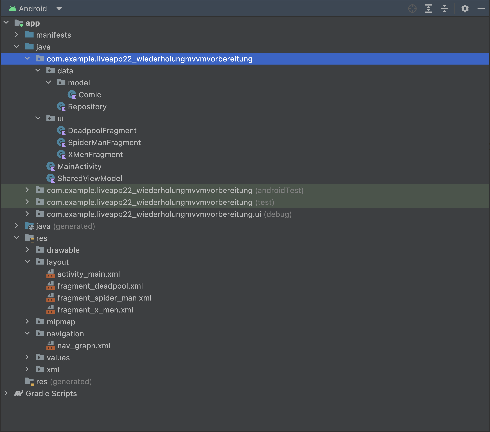

# Aufgaben

## MVVM

In der heutigen App, sollt ihr eine voll Funktionsfähige App in der MVVM Architektur, mit 
SharedViewModel und LiveData, programmieren. Was ihr euch in dieser anzeigen lasst, ist euch überlassen!  
Pflicht in dieser App ist es, Kommentare zu nutzen. Erklärt euch selbst in den Kommentaren, was die
einzelnen Codeabschnitte tun und wofür sie benutzt werden. Geht ruhig ins Detail. Je besser ihr euch
die App erklärt, desto besser versteht ihr das Thema und habt eine gute Quelle, um während eurer Praxisphase
nachzuschlagen!  
Ebenso ist es Pflicht, die App zu pushen. Vergesst es also nicht!  

Als Beispiel bekommt ihr noch einmal Screenshots der LiveApp. Diese sollt ihr NICHT nachprogrammieren.
Es ist Pflicht, eine eigene App zu schreiben.  

1. Erinnere dich an die MVVM Architektur. Sie könnte wie folgt aussehen:

2. Starte damit, die Dependencies einzufügen.  
3. Erstelle alle Packages, Klassen und Fragmente.  
4. Designe alle Layouts.  
5. Erstelle alle Navigationskomponenten, sofern du Navigation nutzt.   
6. Programmiere den "Model" Abschnitt der App.  
7. Programmiere das SharedViewModel. Wahrscheinlich wirst du beim programmieren der Fragmente 
hierher zurück kommen, um die Logik zu ergänzen.  
8. Programmiere den "View" Abschnitt der MVVM Struktur.  
9. Schaue nochmal in die LiveApps, nutze das Internet und stelle gezielte Fragen im Slack oder Zoom.

